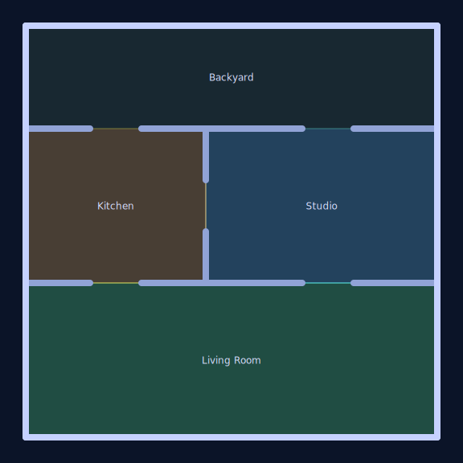

# danielsmith.io

Production-ready Vite + Three.js sandbox for the future danielsmith.io scene. It renders an orthographic isometric room with keyboard-driven sphere movement so we can iterate on spatial UX while keeping repo hygiene tight via Flywheel conventions.

Latest résumé: [docs/resume/2025-09/daniel-smith-resume-2025-09.tex](docs/resume/2025-09/daniel-smith-resume-2025-09.tex) (CI builds PDF and DOCX).

### Vision roadmap & prompt library

- **Roadmap** – Long-term milestones live in [docs/roadmap.md](docs/roadmap.md); it sequences
  lighting, environment, POIs, HUD work, accessibility, and avatar polish into cohesive phases.
- **Agent prompts** – Ready-to-run Codex prompts are indexed in
  [docs/prompts/summary.md](docs/prompts/summary.md) so automation tasks stay focused and
  reproducible.

## Quick start

```bash
npm install
npm run dev
```

## Floor plan

The prototype now spans two connected rooms that form an L-shaped footprint. A doorway carved into the
shared wall links the living space to the studio, letting us explore navigation through multiple
zones. The LED strips that edge each room can be tuned independently (for example, green for the
living room and blue for the studio) so color palettes can evolve per space.

The top-down diagram below is generated by CI whenever the floor plan changes (and can be refreshed
locally with `npm run floorplan:diagram`).



## Project scripts

- `npm run dev` – start the Vite dev server.
- `npm run build` – production build (also used for the CI smoke test).
- `npm run smoke` – build plus a check that `dist/index.html` exists.
- `npm run preview` – preview the production build locally.
- `npm run lint` – ESLint over the TypeScript sources.
- `npm run format:check` / `npm run format:write` – Prettier in check or write mode.
- `npm run test` / `npm run test:ci` – Vitest unit tests (CI uses the `:ci` variant).
- `npm run typecheck` – TypeScript type checking without emit.
- `npm run docs:check` – verifies required docs (including the Codex automation prompt) are present.
- `npm run check` – convenience command that chains lint, test:ci, and docs:check.

### Local quality gates

Run the Flywheel-aligned checks before pushing:

```bash
npm run lint
npm run test:ci
npm run docs:check
npm run smoke
```

Pre-commit is configured with the same commands plus basic formatting hooks. Compared to the full Flywheel stack we omit the Python-heavy aggregate hook to keep this web-only repo light; see below for details.

## Architecture notes

- **Camera** – Orthographic camera with a constant world height (`CAMERA_SIZE = 20`). On resize we recompute the left/right bounds from the new aspect ratio and call `updateProjectionMatrix()` to keep scale consistent.
- **Lighting** – Ambient + directional key lights are now complemented by emissive LED cove strips
  with a lightweight bloom pass so the room inherits a soft gradient glow without heavy shadows.
- **Controls** – `KeyboardControls` listens for `keydown`/`keyup` using `event.key` strings (WASD + arrow keys) and feeds the movement loop, which clamps the player inside the room bounds.
- **Backlog** – Future scene work is tracked in [`docs/backlog.md`](docs/backlog.md).

## Flywheel alignment

- Canonical Codex automation prompt lives at [`docs/prompts/codex/automation.md`](docs/prompts/codex/automation.md) and is referenced by CI/docs checks.
- `.editorconfig`, Prettier, ESLint, and GitHub Actions follow the Flywheel template with a smaller surface area tailored for this Vite app.
- `.pre-commit-config.yaml` keeps the baseline hooks (whitespace, YAML) and swaps the heavy multi-language runner for direct npm scripts. This deviation is intentional to avoid unused Python dependencies in this repo.

## Controls

- **Movement** – `WASD` or arrow keys to roll the sphere around the room.
- **Touch** – Drag the left half of the screen for movement and the right half to pan the camera via the on-screen joystick.

## Smoke testing

`npm run build` generates the distributable assets and the CI suite asserts that `dist/index.html` exists as part of the build step.
