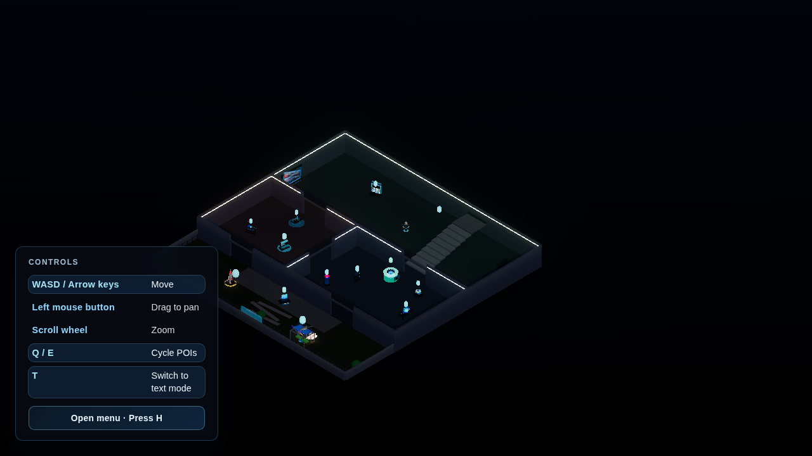

# danielsmith.io

[](https://github.com/futuroptimist/danielsmith.io/actions/workflows/01-lint-format.yml)
[](https://github.com/futuroptimist/danielsmith.io/actions/workflows/02-tests.yml)
[](https://github.com/futuroptimist/danielsmith.io/actions/workflows/03-docs.yml)
[](https://github.com/futuroptimist/danielsmith.io/actions/workflows/04-launch-screenshot.yml)
[](https://github.com/futuroptimist/danielsmith.io/actions/workflows/floorplan-diagram.yml)
[](https://github.com/futuroptimist/danielsmith.io/actions/workflows/resume.yml)
[](LICENSE)

Production-ready Vite + Three.js playground for the future danielsmith.io experience.
The scene renders an orthographic isometric room with keyboard-driven mannequin movement so
we can iterate on spatial UX while keeping repo hygiene tight. The project was originally
bootstrapped from the [`flywheel`](https://github.com/futuroptimist/flywheel) template and
keeps the familiar conventions while focusing purely on the web stack.

### Directionality and facing

The camera is isometric/orthographic and the room is rotated ~45°. Directional input is
defined from the camera’s view:

- `W`/`ArrowUp`: north (away from camera)
- `S`/`ArrowDown`: south (toward camera)
- `A`/`ArrowLeft`: west (left from camera)
- `D`/`ArrowRight`: east (right from camera)

Avatar facing is computed from the camera-relative movement vector; see
`src/systems/movement/facing.ts` for helpers and `src/main.ts` for integration.

## Launch state



> The `Launch screenshot` workflow regenerates and auto-commits this asset after merges to
> `main`, keeping the README image in sync without storing binaries in feature branches.

## Key resources

- **Roadmap** – Long-term milestones are sequenced in [docs/roadmap.md](docs/roadmap.md)
  covering lighting, environment, HUD work, accessibility, and avatar polish.
- **Backlog** – Near-term scene tasks, including deferred touch controls, live in
  [docs/backlog.md](docs/backlog.md).
- **UI placement guide** – Compare in-world vs. overlay treatments in
  [docs/guides/in-world-vs-overlay.md](docs/guides/in-world-vs-overlay.md).
- **Résumé** – Latest résumé source is
  [`resume.tex`][resume-src].
  CI renders PDF and DOCX artifacts.
- **Prompt library** – Automation-ready Codex prompts are summarized in
  [`summary.md`][prompt-summary] and expanded across topical files in
  `docs/prompts/codex/` (automation, lighting, avatar, HUD, POIs, accessibility, and more).
- **Preview overrides** – Use [`createImmersiveModeUrl`](src/ui/immersiveUrl.ts) to build
  immersive links. It now accepts canonical URLs and always injects
  `mode=immersive&disablePerformanceFailover=1` so manual previews keep both overrides even when
  you append debugging or UTM flags.

## Map of the repo

- **Scene data** – [`src/assets/`](src/assets/) collects floor plans, localisation, performance budgets, and theming tokens.
- **Simulation systems** – [`src/systems/`](src/systems/) powers input controls, audio, collision, and failover heuristics.
- **Three.js composition** – [`src/scene/`](src/scene/) assembles avatar rigs, lighting, structures, and POI orchestration.
- **HUD & overlays** – [`src/ui/`](src/ui/) renders accessibility surfaces, HUD widgets, and the immersive URL helpers.
- **Tests** – [`src/tests/`](src/tests/) (Vitest) and [`playwright/`](playwright/) capture unit and end-to-end coverage, including the keyboard traversal macro.
- **Docs & planning** – [`docs/roadmap.md`](docs/roadmap.md), [`docs/backlog.md`](docs/backlog.md), and the prompt library in [`docs/prompts/`](docs/prompts/) track longer-term intent.
- **Architecture notes** – See [`docs/architecture/scene-stack.md`](docs/architecture/scene-stack.md) for a visual of the data → systems → scene → UI flow.

### Scene module composition & state flow

State always originates from data, flows through systems, powers the Three.js scene, and finally reaches DOM overlays:

1. **Assets (`src/assets/`)** expose immutable data (floor plans, POI metadata, performance budgets, localisation strings). These modules remain side-effect free so Vitest and Playwright suites can import them directly.
2. **Systems (`src/systems/`)** transform assets into behaviour. Keyboard controls, collision, accessibility presets, and failover heuristics emit typed handles that the rest of the app consumes.
3. **Scene (`src/scene/`)** composes meshes and rigs from those handles. Builders return lightweight APIs (`createWorld`, `createAvatarRig`) so tests and HUD overlays can observe state without mutating Three.js internals.
4. **UI (`src/ui/`)** mirrors scene state for accessibility. HUD widgets subscribe to system handles, surface ARIA-complete overlays, and never reach back into scene objects.

For diagrams, contracts, and specific entry points see [`docs/architecture/scene-stack.md`](docs/architecture/scene-stack.md).

## Getting started

```bash
npm install
npm run dev
```

## Floor plan

The ground level now opens up dramatically—the living room, studio, kitchen, and backyard each
double their footprint so the scene has space for larger set pieces and navigation experiments. A
new staircase carries the player to an upper landing that fans out into the Creators Studio, Loft
Library, and a ring of Focus Pods for heads-down work.

Each floor has its own auto-generated diagram (regenerated locally with
`npm run floorplan:diagram` and in CI whenever layouts change):


## Project scripts

| Script                                          | Purpose                                                                |
| ----------------------------------------------- | ---------------------------------------------------------------------- |
| `npm run dev`                                   | Start the Vite development server.                                     |
| `npm run build`                                 | Create a production build (also used by CI smoke tests).               |
| `npm run preview`                               | Preview the production build locally.                                  |
| `npm run lint`                                  | Run ESLint on the TypeScript sources.                                  |
| `npm run format:check` / `npm run format:write` | Check or apply Prettier formatting.                                    |
| `npm run test` / `npm run test:ci`              | Execute the Vitest suite (CI uses `:ci`).                              |
| `npm run typecheck`                             | Type-check with TypeScript without emitting files.                     |
| `npm run docs:check`                            | Ensure required docs (including Codex prompts) exist.                  |
| `npm run smoke`                                 | Build and assert that `dist/index.html` exists.                        |
| `npm run check`                                 | Convenience command chaining lint, test:ci, and docs:check.            |
| `npm run press-kit`                             | Emit `docs/assets/press-kit.json` with POI and media manifest details. |

### Local quality gates

Run the Flywheel-style checks before pushing to stay aligned with CI:

```bash
npm run lint
npm run test:ci
npm run docs:check
npm run smoke
```

Pre-commit mirrors these commands alongside formatting hooks. Compared to the full
Flywheel stack, we skip the Python-heavy aggregate hook to keep this web-focused repo
lightweight.

## Testing & automation

- **Vitest unit suites** – [`src/tests/`](src/tests/) run via `npm run test:ci`. Export `CI=1` locally to mirror pipeline behaviour and disable watch mode.
- **Playwright end-to-end specs** – [`playwright/`](playwright/) run with `npm run test:e2e` (alias: `npm run screenshot`). `CI=1` forces a single worker for deterministic WebGL bootstrapping.
  Install browsers once with `npx playwright install --with-deps chromium-headless-shell` so the suite can
  launch the headless shell build locally.
- **Visual smoke thresholds** – [`playwright.config.ts`](playwright.config.ts) loads [`VISUAL_SMOKE_DIFF_BUDGET`](src/assets/performance.ts#L37-L45) so `expect().toHaveScreenshot` allows at most a 0.015 diff ratio or 1,200 differing pixels.
- **Keyboard traversal macro** – [`playwright/keyboard-traversal.spec.ts`](playwright/keyboard-traversal.spec.ts) touches every POI and HUD overlay using keyboard-only input. Use `npm run test:e2e -- --grep traversal` to run just that macro when iterating.
- **Animation QA checklist** – [`docs/media/animation-qa.md`](docs/media/animation-qa.md) links the IK contact/footstep sync tests and describes how to capture fresh clips when polishing locomotion.
- **Docs validation** – `npm run docs:check` enforces prompt, roadmap, and architecture coverage.
- **Launch smoke** – `npm run smoke` builds the project once and asserts `dist/index.html` exists before heavier suites run.
- **Link preview heuristics** – Automated user-agent checks steer social/chat crawlers
  (Facebook, Twitter, Slack, Discord, LinkedIn, Telegram, WhatsApp, Skype, and others) to
  the text tour so share cards render without WebGL.

## Auto-generated assets

| Script                      | Output                        | Refresh trigger                                                                                     |
| --------------------------- | ----------------------------- | --------------------------------------------------------------------------------------------------- |
| `npm run floorplan:diagram` | `docs/assets/floorplan-*.svg` | Run after editing layout data in `src/assets/floorplan/**`. CI regenerates diagrams after merges.   |
| `npm run launch:screenshot` | `docs/assets/game-launch.png` | Run whenever lighting, camera, or HUD composition shifts. CI captures a fresh image post-merge.     |
| `npm run smoke`             | `dist/index.html` (assert)    | Ensures the production build succeeds before visual diffs or E2E suites rely on generated assets.   |
| `npm run press-kit`         | `docs/assets/press-kit.json`  | Refresh after updating POI copy, performance budgets, or media listings to keep the export current. |

Keep pipelines deterministic by regenerating assets immediately after touching geometry, lighting, or HUD composition so CI diffs stay tidy.

## Performance guardrails

- Budgets and the baseline snapshot live in [`src/assets/performance.ts`](src/assets/performance.ts); see [`docs/architecture/performance-budgets.md`](docs/architecture/performance-budgets.md) for measurement notes and lazy-loading plans.
- [`src/tests/performanceBudget.test.ts`](src/tests/performanceBudget.test.ts) enforces headroom.
- Playwright screenshot expectations inherit the diff budget via [`playwright.config.ts`](playwright.config.ts), keeping `toHaveScreenshot` tolerant to minor bloom noise while failing significant shifts.

## Accessibility overlays

- Follow the checklist in [`docs/guides/accessibility-overlays.md`](docs/guides/accessibility-overlays.md) to keep ARIA labels, focus order, and text alternatives aligned with in-world metadata.
- The POI tooltip overlay mirrors registry copy; run the keyboard macro above to confirm parity before shipping new exhibits.

## Architecture notes

- **Camera** – Orthographic camera with a constant world height (`CAMERA_SIZE = 20`). On resize we recompute the left/right bounds from the new aspect ratio and call `updateProjectionMatrix()` to keep scale consistent.
- **Lighting** – Ambient + directional key lights now pair with emissive LED cove strips and baked
  gradient lightmaps so the room inherits a dusk bounce wash without heavy shadows. LED pulses are
  authored in `src/scene/lighting/ledPulsePrograms.ts` so per-room timelines stay data-driven.
  A Shift+L debug toggle disables bloom/LED accents to compare raw material response.
- **Controls** – `KeyboardControls` listens for `keydown`/`keyup` using `event.key` strings (WASD + arrow keys) and feeds the movement loop, which clamps the player inside the room bounds.
- **HUD overlay** – The floating movement legend now reacts to the most recent input method
  (keyboard, mouse, or touch) and swaps the interact hint to match, so visitors always see the
  action verb that applies to their device.
- **Points of Interest** – A data-driven registry spawns holographic pedestals with animated
  tooltips for featured repos. Proximity-based halos ease the labels in so players sense each
  interaction radius without clutter, and a DOM overlay mirrors the metadata so screen readers and
  keyboard users receive the same context. A cognitive load-aware interaction timeline now staggers
  live region announcements so discovery prompts never rapid-fire when players browse exhibits.
  Metadata is authored in TypeScript so future automations
  can extend exhibits by updating data alone, and the studio desk now hosts a Jobbot holographic
  terminal with orbiting telemetry shards that pulse in sync with the automation POI. The living
  room's gitshelves array now
  extrudes nightly commit streaks into illuminated shelving mosaics with sync signage overhead.
- **Localization** – UI chrome and POI copy are centralized in `src/assets/i18n/index.ts`, letting future
  locales load structured strings while keeping Vitest coverage in
  `src/tests/i18n.test.ts` to guard against regressions. HUD overlays and the
  text fallback now tag their containers with locale direction metadata so RTL
  languages flow correctly even before full translations land.
- **Audio captions** – A subtitles overlay now calls out ambient beds and POI narration with
  cooldown-aware timing so visitors who mute audio or rely on captions still catch the
  story beats.
- **Backyard installations** – The dusk courtyard now features a DSPACE-inspired model rocket on a
  lit launch pad with a safety halo, tying the exterior exhibits into the narrative while the nav
  colliders keep players clear of the ignition zone.
- **Avatar pipeline** – `createAvatarImporter` validates GLTF bone and animation requirements,
  insists required bones are bound to active skeletons, and can attach a DRACO decoder path so
  future mannequins load consistently. A stylized emissive mannequin now rides on the controller
  collider so the space feels inhabited even before the hero avatar lands.
- **Backlog** – Future scene work is tracked in [`docs/backlog.md`](docs/backlog.md).

## Controls

- **Movement** – Use `WASD` or arrow keys to guide the mannequin.
- **Key remapping** – Use `portfolio.input.keyBindings.setBinding('interact', ['e'])`
  in the browser console to try alternate bindings. HUD prompts update instantly and
  the mapping persists locally.
- **Touch** – Drag the on-screen joysticks (left: movement, right: camera pan) on touch devices.
- **Lighting debug** – Press `Shift` + `L` to toggle bloom and LED strips for comparison captures.
- **Mode toggle** – Press `T` or select the "Text mode" overlay button to jump into the
  lightweight portfolio view at any time.
- **Accessibility presets** – Pick Standard, Calm, High contrast, or Photosensitive-safe modes
  from the HUD to soften bloom, boost readability, reduce motion cues, and tune emissive
  lighting. The Photosensitive-safe preset now also smooths greenhouse grow lights, walkway
  lanterns, and holographic beacons so emissive pulses settle into a steady glow for
  flicker-sensitive players.
- **Help** – Use the help key (default `H` or `?`), or tap the HUD Help button to
  open a modal with controls, accessibility tips, and failover guidance.
- **Failover** – Append `?mode=text` to the URL to load the lightweight text view.
  Automatic detection now covers missing WebGL support, sustained frame rates below 30 FPS,
  low-memory and low-core devices, data-saver preferences, slow 2G network hints,
  and automated crawlers. A `<noscript>` fallback now routes no-JS clients
  and scrapers to the static tour immediately. Share preview links as
  `http://localhost:5173/?mode=immersive&disablePerformanceFailover=1`
  (swap host/port as needed) to force the full scene even on throttled preview clients.
  Screen readers now announce each switch so assistive technology users
  know which mode is active.

## Automation prompts

The canonical Codex automation prompt lives at
[`baseline.md`][baseline-prompt] and feeds both docs
checks and CI routines. Additional specialized prompts (lighting, avatar, HUD, POIs, i18n,
performance, modes, animation, and more) provide ready-to-run task scaffolding for agents.

## Smoke testing

`npm run build` generates distributable assets, and CI asserts that `dist/index.html`
exists as part of the smoke suite.

[resume-src]: docs/resume/2025-09/resume.tex
[prompt-summary]: docs/prompts/summary.md
[baseline-prompt]: docs/prompts/codex/baseline.md
