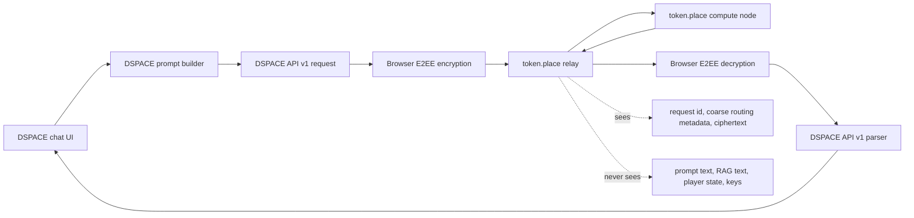
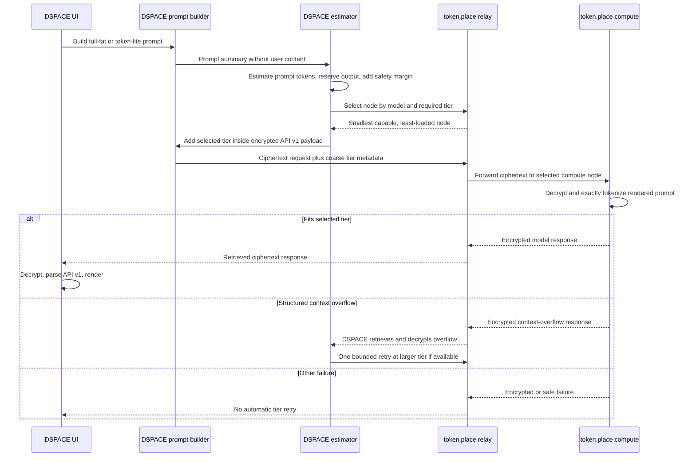

# DSPACE token.place context tiers

## Purpose

This document defines the DSPACE-side design for benchmarking, estimating, routing, and
validating full-fat DSPACE chat through token.place API v1 context tiers. It is scoped to
DSPACE responsibilities and the API v1 integration path. token.place responsibilities are
called out only where DSPACE depends on them.

The design does not introduce API v2 behavior, streaming behavior, application code changes,
or dependency changes.

## Current state and blocker

DSPACE staging `main-0dd9127` successfully completed token.place API v1 end-to-end encrypted
chat with token-lite enabled. That staging run proves the current API v1 path works across:

- DSPACE request construction.
- Relay selection.
- Client-side encryption.
- token.place compute processing.
- Response retrieval.
- Client-side decryption.
- API v1 response parsing.
- UI rendering.

The remaining blocker is not the E2EE request path. The blocker is context capacity and
workload routing for full-fat DSPACE prompts that include system instructions, retrieval
augmented generation context, player state, and chat history.

DSPACE currently permits up to 64 API v1 messages, 32,768 characters per message, and
131,072 total message-content characters. The 131,072-character ceiling is roughly 32K tokens
under the common four-characters-per-token heuristic. That value is only a rough estimate: it
is not an exact tokenizer result and does not include chat-template overhead or output-token
reservation.

Initial token.place service profiles are:

| Tier       | Total context tokens | Expected DSPACE usage         |
| ---------- | -------------------: | ----------------------------- |
| `8k-fast`  |                8,192 | token-lite and small requests |
| `64k-full` |               65,536 | full-fat DSPACE prompts       |

DSPACE should prefer the smallest tier likely to satisfy the request. token-lite should
normally fit `8k-fast`. Full-fat DSPACE prompts may require `64k-full`. The compute node
remains the authoritative admission controller after decrypting and exactly tokenizing the
rendered prompt.

Relay-visible routing information must stay coarse and privacy-safe. The relay must not
receive prompt text or exact tokenized content.

## Non-goals

- Do not design or modify token.place API v2.
- Do not add API v1 streaming.
- Do not replace token.place's compute-side exact admission controller.
- Do not expose prompt text, RAG excerpts, player state, ciphertext, keys, or decrypted
  responses in logs or diagnostics.
- Do not silently truncate user-visible prompts after compute-side rejection unless a separate
  truncation design is approved and surfaced to the user.
- Do not infer raw operator hardware identity from relay-visible metadata.

## Current-state architecture



The current path is proven for token-lite. It lacks a DSPACE-side context estimate, tier
classification, and tier-aware server selection before submitting larger full-fat prompts.

## Proposed request sequence



## DSPACE-side contract

DSPACE owns the conservative preflight contract that decides which tier to request before the
relay chooses a node.

### Prompt summary

DSPACE must build a deterministic prompt-summary structure that never contains user content.
The structure may include counts and component names, but not message text, RAG excerpts,
player-state values, ciphertext, keys, or decrypted responses.

Required fields:

```json
{
  "schemaVersion": 1,
  "requestId": "opaque-client-request-id",
  "mode": "token-lite|full-fat",
  "messageCount": 0,
  "characterCount": 0,
  "utf8ByteCount": 0,
  "components": [
    {
      "name": "system|rag|player-state|chat-history|user-message|tool-context",
      "messageCount": 0,
      "characterCount": 0,
      "utf8ByteCount": 0,
      "estimatedTokens": 0
    }
  ]
}
```

The summary must be deterministic for the same rendered prompt composition, excluding
unstable IDs and timestamps unless those fields are explicitly required for correlation.

### Browser-safe conservative estimate

DSPACE should estimate tokens in the browser without requiring exact model tokenization. The
estimator must be conservative enough for mixed content, including UTF-8-heavy, code-heavy,
JSON-heavy, whitespace-heavy, and long-RAG inputs.

The estimate must include:

- Prompt-content estimate.
- Chat-template overhead estimate.
- Output-token reservation.
- Safety margin.

The estimate must explicitly identify over-limit state rather than relying on submit-and-fail.
The compute node still performs authoritative exact admission after decryption.

### Tier classification result

DSPACE classification returns:

```json
{
  "selectedTier": "8k-fast|64k-full|null",
  "estimatedPromptTokens": 0,
  "reservedOutputTokens": 0,
  "safetyMarginTokens": 0,
  "estimatedTotalContextUse": 0,
  "overLimit": false,
  "reason": "fits-8k|fits-64k|exceeds-known-tiers"
}
```

### Routing and encrypted request

DSPACE sends relay-visible routing metadata that is limited to model, required context tier,
request ID, and other privacy-safe coarse metadata. DSPACE repeats the selected tier inside
the encrypted API v1 request so the compute node can verify that the decrypted payload matches
the routed tier.

### Polling, retry, and rejection handling

DSPACE should use context-aware polling deadlines because a `64k-full` prompt may have higher
prefill latency than an `8k-fast` token-lite prompt.

DSPACE may perform one bounded retry only when all of these are true:

1. The response is a structured encrypted context-overflow response.
2. The first attempt used `8k-fast`.
3. A `64k-full` node is available for the same model.
4. The request is safe to replay under the existing API v1 semantics.

DSPACE must not automatically retry for policy failures, network failures, malformed responses,
general provider failures, or unknown errors. DSPACE must not silently truncate after a
compute-side context rejection unless a separate design defines the truncation behavior and
user-facing disclosure.

## Tier-selection decision table

| Estimated total context use | 8K availability | 64K availability | DSPACE action                                          |
| --------------------------: | --------------- | ---------------- | ------------------------------------------------------ |
|                  `<= 8,192` | Available       | Any              | Select `8k-fast`.                                      |
|                  `<= 8,192` | Unavailable     | Available        | Select `64k-full` as spillover.                        |
|                 `<= 65,536` | Any             | Available        | Select `64k-full`.                                     |
|                 `<= 65,536` | Any             | Unavailable      | Surface no-capable-tier state.                         |
|                  `> 65,536` | Any             | Any              | Block or surface over-limit before submit.             |
|            Unknown estimate | Any             | Any              | Use conservative failure or safest larger tier policy. |

Small work may spill to a larger tier only when no smaller eligible node is available.

## Phase 0: Measurement and instrumentation

Phase 0 measures real DSPACE prompt composition without recording prompt text.

Capture these values:

- Message count.
- Character count.
- UTF-8 byte count.
- Estimated tokens.
- Component-level contribution.
- Prompt-build time.
- RAG time.
- Encryption time.
- Queue and retrieval time.
- End-to-end latency.

Representative benchmark scenarios:

1. token-lite baseline.
2. Minimal new-game state.
3. Typical mid-game state.
4. RAG-heavy state.
5. Long chat history.
6. Large player-state payload.
7. Near-DSPACE API character ceiling.

Benchmark outputs should be local JSON and Markdown files that are not committed with user
content. Fixtures must be synthetic or deterministic repository fixtures.

### Benchmark schema

```json
{
  "schemaVersion": 1,
  "createdAt": "2026-06-22T00:00:00.000Z",
  "scenario": "token-lite-baseline",
  "dspaceRevision": "main-0dd9127",
  "mode": "token-lite|full-fat",
  "messageCount": 0,
  "characterCount": 0,
  "utf8ByteCount": 0,
  "estimatedPromptTokens": 0,
  "reservedOutputTokens": 0,
  "safetyMarginTokens": 0,
  "estimatedTotalContextUse": 0,
  "selectedTier": "8k-fast|64k-full|none",
  "componentContributions": [
    {
      "name": "system|rag|player-state|chat-history|user-message|tool-context",
      "messageCount": 0,
      "characterCount": 0,
      "utf8ByteCount": 0,
      "estimatedTokens": 0
    }
  ],
  "timingsMs": {
    "promptBuild": 0,
    "rag": 0,
    "encryption": 0,
    "queueAndRetrieval": 0,
    "endToEnd": 0
  },
  "result": {
    "status": "success|context-overflow|provider-error|network-error|malformed-response",
    "safeErrorCode": "optional-safe-code"
  }
}
```

## Phase 1: Two static physical tiers

Phase 1 introduces two manually selected physical operator tiers:

- Mac Mini M4 Pro with 24 GB unified memory targets `8k-fast`.
- Windows PC with RTX 4090 24 GB VRAM and 128 GB DDR5 targets `64k-full`.

The context tier is selected manually before starting the token.place operator. A compute node
warms exactly one selected tier before registration. Switching tiers requires stopping the
operator, changing the tier, warming the new runtime, and re-registering.

DSPACE estimates a tier before selecting a node. Compute nodes enforce the exact context
budget after decryption. A structured encrypted overflow error may trigger one retry from
`8k-fast` to `64k-full`.

## Phase 2: Capability-aware and load-aware routing

Phase 2 moves routing from blind selection to service-capability selection. Nodes advertise
derived service capabilities rather than raw hardware identity. Relay selection filters by
model and required context tier.

The scheduler prefers:

1. The smallest capable tier.
2. The least-loaded eligible node.
3. Spillover to a larger tier only when no smaller eligible node is available.

Queue depth, in-flight work, and max concurrency influence selection. The relay may see safe
routing metadata such as tier ID, queue depth buckets, in-flight counts, max concurrency, and
request IDs. It must not receive prompt text or exact tokenized content.

## Phase 3: Runtime optimization

Phase 3 benchmarks runtime choices after the two-tier path is functional. The benchmark matrix
should include flash attention, f16/q8/q4 KV cache, `offload_kqv`, `n_batch`, `n_ubatch`,
prompt caching, and backend-specific behavior.

Track:

- Memory consumption.
- Prefill throughput.
- Decode throughput.
- Time to first token or first response.
- Total latency.
- Output quality.

Do not assume Google AI or rule-of-thumb memory estimates are sufficient for admission. Record
the planning estimate that a 64K f16 KV cache for Llama 3.1 8B GQA may consume roughly 8 GB
before model weights and runtime buffers, but require empirical verification before using that
estimate for admission or capacity planning.

## Phase 4: Same-device multi-tier research

Phase 4 is future research, not part of the initial implementation. Candidate approaches:

- Multiple high-level `Llama` instances.
- One shared model with multiple low-level llama.cpp contexts.
- A llama-server sidecar with slots, continuous batching, prompt caching, metrics, and
  speculative decoding.
- Dynamic tier switching or eviction based on available memory.

These investigations may improve utilization, but Phase 1 should keep the operator model
simple: one warmed tier per compute node registration.

## Privacy and observability requirements

DSPACE must never log:

- Message text.
- RAG excerpts.
- Player state.
- Keys.
- Ciphertext.
- Decrypted responses.

Telemetry may contain counts, durations, tier IDs, safe error codes, request IDs, and
aggregate sizes. Production instrumentation must be opt-in or emitted only through existing
privacy-safe diagnostics. Benchmark fixtures must be synthetic or deterministic repository
fixtures.

## Failure-mode table

| Failure mode                            | Detected by           | Automatic retry?     | User-visible behavior                 |
| --------------------------------------- | --------------------- | -------------------- | ------------------------------------- |
| Estimated request exceeds known tiers   | DSPACE estimator      | No                   | Explain that the prompt is too large. |
| No node supports selected tier          | Relay selection       | No                   | Surface no-capable-node state.        |
| Compute exact tokenizer rejects context | Compute node          | Once, 8K to 64K only | Retry once or show context overflow.  |
| Policy rejection                        | Compute node/provider | No                   | Surface policy-safe failure.          |
| Network failure                         | Browser or relay      | No tier retry        | Surface transport failure.            |
| Malformed API v1 response               | DSPACE parser         | No                   | Surface malformed-response failure.   |
| General provider failure                | Compute node/provider | No                   | Surface provider failure.             |
| Retry also overflows                    | Compute node          | No more retries      | Surface context overflow.             |

## Acceptance and testing strategy

- Unit tests for estimator boundaries and tier selection.
- Unit tests for UTF-8, code-heavy, JSON-heavy, whitespace-heavy, and long-RAG inputs.
- End-to-end tests with mocked `8k-fast` and `64k-full` compute-node responses.
- Staging validation for token-lite on `8k-fast` and full-fat chat on `64k-full`.
- Verification that relay-visible requests remain ciphertext-only plus safe metadata.
- Verification that retry is bounded to one tier escalation.
- Verification that selected tier is repeated inside the encrypted API v1 request.
- Verification that context-aware polling deadlines are applied per tier.

## Rollout plan

1. Land this design document.
2. Add privacy-safe measurement and local benchmark output behind diagnostics.
3. Add DSPACE estimator and tier classification without changing routing behavior.
4. Add tier-aware node selection using token.place API v1 capability metadata.
5. Add encrypted selected-tier echo in API v1 payloads.
6. Add compute-overflow handling and one bounded 8K-to-64K retry.
7. Validate token-lite on `8k-fast` in staging.
8. Validate full-fat chat on `64k-full` in staging.
9. Enable gradually for production users through opt-in diagnostics or guarded rollout.

## Rollback plan

- Disable tier-aware routing and return to the proven token-lite path.
- Keep measurement disabled or local-only if diagnostics create operational risk.
- Disable bounded retry independently if retry behavior causes duplicate work or confusing UX.
- Continue accepting token.place API v1 non-streaming responses through the existing parser.
- Preserve all privacy restrictions during rollback; do not add verbose prompt logging to debug
  rollback issues.

## Open questions

- What conservative browser estimator formula best covers mixed natural language, JSON, code,
  whitespace, and UTF-8 without excessive 64K over-selection?
- How large should the default output-token reservation be for token-lite and full-fat chat?
- What safety margin should DSPACE use per tier?
- Which safe routing fields are sufficient for token.place scheduling without leaking prompt
  shape more than necessary?
- What polling deadline should apply to `64k-full` prefill-heavy requests?
- Should DSPACE surface a user-facing explanation before submitting a request estimated to need
  `64k-full`?
- Which deterministic synthetic fixtures best represent RAG-heavy and player-state-heavy DSPACE
  prompts?

## Future work

Long-term issues should track:

- Exact browser tokenizer support.
- llama-server operator mode.
- Multiple warm contexts on one device.
- Shared-model contexts.
- Dynamic memory-based tier selection.
- Advanced scheduling across queue depth, latency, and capability signals.
- Prompt caching.
- Speculative decoding.
- API v2 streaming, explicitly outside this API v1 design.
