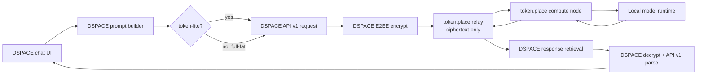
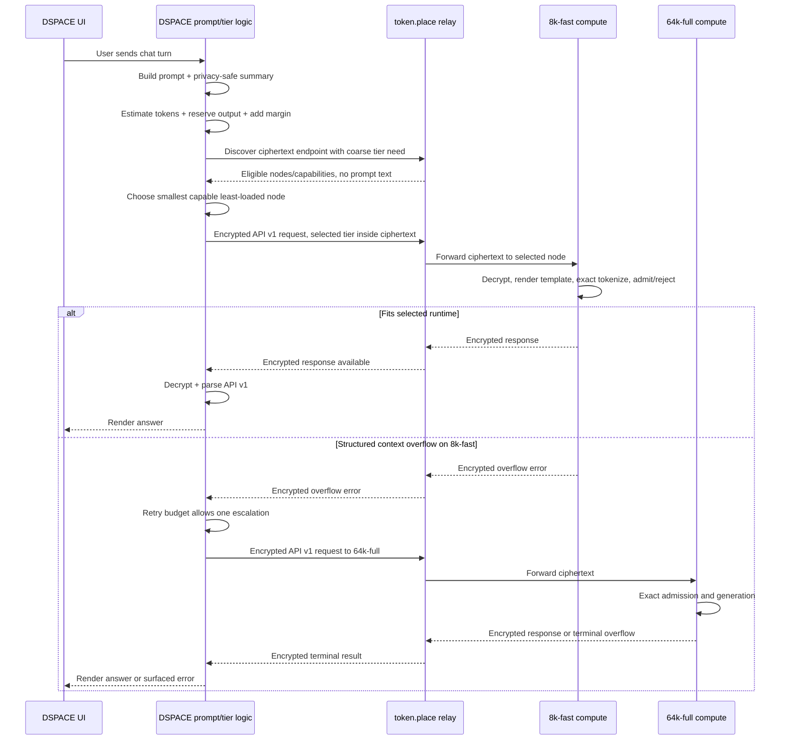

# token.place context tiers for full-fat DSPACE chat

## Purpose

This design defines the DSPACE-side plan for measuring, estimating, routing, and validating
full-fat DSPACE chat requests through token.place API v1 context tiers. It keeps API v1
relay-blind end-to-end encryption intact while adding enough coarse routing metadata for DSPACE to
prefer the smallest compute tier likely to satisfy a request.

The document is intentionally DSPACE-scoped. token.place owns operator registration, relay
scheduling, compute-node admission, model execution, encrypted error envelopes, and any future API
surface. DSPACE owns prompt construction, privacy-safe local measurement, conservative browser-side
tier estimates, tier-aware server selection, retry policy, and user-visible failure handling.

## Non-goals

- Do not design or modify token.place API v2.
- Do not add API v1 streaming.
- Do not expose prompt text, exact tokenized content, RAG excerpts, player state, ciphertext, keys,
  or decrypted responses to relays, logs, or analytics.
- Do not silently truncate prompts after a compute-side context rejection.
- Do not make rule-of-thumb memory estimates authoritative for admission.
- Do not require a single device to host multiple warm context tiers in the initial implementation.
- Do not change DSPACE game, quest, chat, RAG, relay, or provider behavior as part of this design
  document.

## Current state

DSPACE staging `main-0dd9127` successfully completed token.place API v1 E2EE chat with
token-lite enabled. That validation proves the existing happy path works end to end:

1. DSPACE constructs an API v1-compatible chat request.
2. DSPACE selects a relay and encrypts the request for token.place compute.
3. token.place relay handles the ciphertext-only request without prompt visibility.
4. token.place compute decrypts, processes the request, and returns an encrypted response.
5. DSPACE retrieves, decrypts, parses API v1 output, and renders the chat response in the UI.

The remaining blocker for full-fat DSPACE chat is context capacity and workload routing. Full-fat
prompts can include system instructions, RAG context, player state, and chat history, so DSPACE must
estimate context use before choosing a token.place node and compute must perform exact admission
after decryption.

Current DSPACE API v1 prompt-shape limits are:

| Limit                                    | Current value | Notes                                   |
| ---------------------------------------- | ------------: | --------------------------------------- |
| Maximum API v1 messages                  |            64 | Applies before encryption.              |
| Maximum characters per message           |        32,768 | Counts message content characters.      |
| Maximum total message-content characters |       131,072 | Roughly 32K tokens using 4 chars/token. |

The 131,072-character ceiling is only a coarse planning proxy. It does not represent exact tokenizer
output and does not include chat-template overhead, role/header tokens, tool-free provider framing,
or output-token reservation.

## Current-state architecture



## Target tiers

Initial token.place profiles are static physical tiers:

| Tier ID    | Total context tokens | Intended workload            | Initial operator target                      |
| ---------- | -------------------: | ---------------------------- | -------------------------------------------- |
| `8k-fast`  |                8,192 | token-lite and small prompts | Mac Mini M4 Pro, 24 GB unified memory        |
| `64k-full` |               65,536 | full-fat DSPACE prompts      | Windows PC, RTX 4090 24 GB VRAM, 128 GB DDR5 |

DSPACE should prefer the smallest tier likely to satisfy the request. token-lite should normally fit
`8k-fast`; full-fat prompts may require `64k-full`. The compute node remains authoritative because
it can decrypt and exactly tokenize the fully rendered prompt with the model's real tokenizer and
chat template.

## DSPACE-side contract

DSPACE should produce a deterministic prompt summary before encryption. The summary must never
contain user content. It should include only counts, durations, component labels, tier IDs, safe
error codes, request IDs, and aggregate sizes.

### Prompt summary structure

Illustrative structure:

```json
{
  "schemaVersion": 1,
  "requestId": "018f-safe-id",
  "mode": "full-fat",
  "messageCount": 12,
  "contentCharacters": 18420,
  "utf8Bytes": 20370,
  "components": [
    { "name": "system", "messages": 1, "characters": 2600, "utf8Bytes": 2600 },
    { "name": "rag", "messages": 4, "characters": 8800, "utf8Bytes": 9500 },
    {
      "name": "playerState",
      "messages": 1,
      "characters": 3000,
      "utf8Bytes": 3250
    },
    { "name": "history", "messages": 6, "characters": 4020, "utf8Bytes": 5020 }
  ],
  "timingsMs": {
    "promptBuild": 18,
    "rag": 42,
    "encryption": 7,
    "queueAndRetrieval": 0,
    "endToEnd": 0
  }
}
```

Component names are fixed buckets, not free-form excerpts. Request IDs must be generated identifiers
that do not encode prompt content.

### Tier classification result

DSPACE's browser-safe estimator should return:

```json
{
  "selectedTier": "64k-full",
  "estimatedPromptTokens": 10900,
  "reservedOutputTokens": 2048,
  "safetyMarginTokens": 1024,
  "estimatedTotalContextUse": 13972,
  "overLimit": false,
  "overLimitReason": null
}
```

Required behavior:

- Estimate prompt tokens conservatively in the browser without exact prompt text leaving DSPACE.
- Reserve output tokens before tier selection.
- Add a safety margin for chat-template overhead and tokenizer variance.
- Classify as over-limit when the estimate plus reservation plus margin exceeds all known tiers.
- Select nodes using tier-aware server discovery.
- Repeat the selected tier inside the encrypted API v1 request so compute can compare the intended
  tier with its active runtime.
- Use context-aware polling deadlines because larger prompts can increase prefill and total latency.
- Allow one bounded retry only when compute returns a structured encrypted context-overflow error
  from `8k-fast` and a `64k-full` node is available.
- Do not retry automatically for policy errors, network failures, malformed responses, relay
  failures, general provider failures, or non-context compute errors.
- Do not silently truncate after compute-side rejection unless a separate truncation design is
  implemented and clearly surfaced to the user.

## Tier-selection decision table

|      Estimated total use | Available eligible tiers | DSPACE selection | Retry behavior                                       |
| -----------------------: | ------------------------ | ---------------- | ---------------------------------------------------- |
|               `<= 8,192` | `8k-fast`, `64k-full`    | `8k-fast`        | One retry to `64k-full` only on structured overflow. |
|               `<= 8,192` | `64k-full` only          | `64k-full`       | No escalation tier remains.                          |
|      `8,193` to `65,536` | `8k-fast`, `64k-full`    | `64k-full`       | No automatic retry to same tier.                     |
|      `8,193` to `65,536` | `8k-fast` only           | No eligible node | Surface capacity unavailable.                        |
|               `> 65,536` | Any                      | Over limit       | Surface prompt too large; do not send.               |
| Unknown estimate failure | Any                      | Fail closed      | Surface estimator failure; do not guess.             |

Small work may spill to `64k-full` only when no smaller eligible node is available or when a bounded
retry follows a structured `8k-fast` overflow.

## Proposed request sequence



## Phase roadmap

### Phase 0: Measurement and instrumentation

Measure real DSPACE prompt composition without recording prompt text. Instrumentation captures:

- Message count.
- Message-content character count.
- UTF-8 byte count.
- Estimated tokens.
- Component-level contribution for system instructions, RAG, player state, chat history, and user
  turn buckets.
- Prompt-build time.
- RAG time.
- Encryption time.
- Queue/retrieval time.
- End-to-end latency.

Representative benchmark scenarios:

| Scenario                          | Purpose                                                                                                   |
| --------------------------------- | --------------------------------------------------------------------------------------------------------- |
| token-lite baseline               | Confirm small requests fit `8k-fast`.                                                                     |
| Minimal new-game state            | Measure first full-fat turn with sparse state.                                                            |
| Typical mid-game state            | Exercise normal RAG, state, and history composition.                                                      |
| RAG-heavy state                   | Stress retrieved context contribution.                                                                    |
| Long chat history                 | Stress conversation accumulation.                                                                         |
| Large player-state payload        | Stress serialized game-state growth.                                                                      |
| Near-DSPACE API character ceiling | Validate estimator behavior near 64 messages, 32,768 characters per message, or 131,072 total characters. |

Benchmark outputs should be local JSON and Markdown files generated from synthetic or deterministic
fixtures. They must not be committed with user content. A safe convention is:

- `benchmark-results/dspace-context-tiers/*.json`
- `benchmark-results/dspace-context-tiers/*.md`

### Phase 1: Two static physical tiers

- Mac Mini M4 Pro with 24 GB unified memory targets `8k-fast`.
- Windows PC with RTX 4090 24 GB VRAM and 128 GB DDR5 targets `64k-full`.
- Context tier is selected manually before starting the token.place operator.
- A compute node warms exactly one selected tier before registration.
- Switching tiers requires stopping the operator, changing the tier, warming the new runtime, and
  re-registering.
- DSPACE estimates a tier before selecting a node.
- Compute nodes enforce the exact context budget after decryption.
- A structured encrypted overflow error may trigger one retry from `8k-fast` to `64k-full`.

### Phase 2: Capability-aware and load-aware routing

- Nodes advertise derived service capabilities rather than raw hardware identity.
- Relay selection filters by model and required context tier.
- The scheduler prefers the smallest capable tier, then the least-loaded node.
- Queue depth, in-flight work, and max concurrency influence selection.
- Small work may spill to a larger tier only when no smaller eligible node is available.

### Phase 3: Runtime optimization

Benchmark runtime settings and backend behavior:

- Flash attention.
- `f16`, `q8`, and `q4` KV cache modes.
- `offload_kqv`.
- `n_batch` and `n_ubatch`.
- Prompt caching.
- Backend-specific behavior.

Track memory, prefill throughput, decode throughput, time to first token or first response, total
latency, and output quality. Do not assume Google AI or rule-of-thumb memory estimates are
sufficient for admission.

Planning estimate to verify: a 64K `f16` KV cache for Llama 3.1 8B GQA may consume roughly 8 GB
before model weights and runtime buffers. This is not an admission rule; it must be empirically
verified against the selected backend, model build, quantization, batch settings, and runtime.

### Phase 4: Same-device multi-tier research

Future investigations, not part of the initial implementation:

- Multiple high-level `Llama` instances.
- One shared model with multiple low-level llama.cpp contexts.
- llama-server sidecar with slots, continuous batching, prompt caching, metrics, and speculative
  decoding.
- Dynamic tier switching or eviction based on available memory.

## Benchmark schema

Local benchmark JSON should be content-free and deterministic:

```json
{
  "schemaVersion": 1,
  "createdAt": "2026-06-22T00:00:00.000Z",
  "gitRevision": "main-0dd9127-or-local-sha",
  "scenario": "typical-mid-game-state",
  "mode": "full-fat",
  "limits": {
    "maxMessages": 64,
    "maxCharactersPerMessage": 32768,
    "maxTotalContentCharacters": 131072
  },
  "promptSummary": {
    "messageCount": 12,
    "contentCharacters": 18420,
    "utf8Bytes": 20370,
    "estimatedPromptTokens": 10900,
    "components": [
      {
        "name": "system",
        "messages": 1,
        "characters": 2600,
        "utf8Bytes": 2600
      },
      { "name": "rag", "messages": 4, "characters": 8800, "utf8Bytes": 9500 },
      {
        "name": "playerState",
        "messages": 1,
        "characters": 3000,
        "utf8Bytes": 3250
      },
      {
        "name": "history",
        "messages": 6,
        "characters": 4020,
        "utf8Bytes": 5020
      }
    ]
  },
  "tierClassification": {
    "selectedTier": "64k-full",
    "reservedOutputTokens": 2048,
    "safetyMarginTokens": 1024,
    "estimatedTotalContextUse": 13972,
    "overLimit": false
  },
  "timingsMs": {
    "promptBuild": 18,
    "rag": 42,
    "encryption": 7,
    "queueAndRetrieval": 830,
    "endToEnd": 3200
  },
  "result": {
    "status": "ok",
    "safeErrorCode": null,
    "retryCount": 0
  }
}
```

Markdown summaries may aggregate rows by scenario, tier, estimate, admission result, latency, and
safe error code. They must not include prompt text or response text.

## Privacy and observability requirements

- Never log message text, RAG excerpts, player state, keys, ciphertext, or decrypted responses.
- Telemetry may contain counts, durations, tier IDs, safe error codes, request IDs, and aggregate
  sizes.
- Production instrumentation must be opt-in or emitted only through existing privacy-safe
  diagnostics.
- Benchmark fixtures must be synthetic or deterministic repository fixtures.
- Relay-visible routing information must remain coarse and privacy-safe.
- The relay must not receive prompt text or exact tokenized content.
- Exact tokenizer results should remain compute-local after decryption unless returned as a safe,
  aggregate encrypted diagnostic.

## Failure modes

| Failure                                      | Detection point            | Retry?                  | User-visible behavior                                                 | Privacy note                       |
| -------------------------------------------- | -------------------------- | ----------------------- | --------------------------------------------------------------------- | ---------------------------------- |
| Browser estimate exceeds all tiers           | DSPACE estimator           | No                      | Prompt too large for available context tiers.                         | No request sent.                   |
| No node for selected tier                    | DSPACE server selection    | No                      | Capacity unavailable; try again later.                                | Relay sees only coarse tier query. |
| Compute exact context overflow on `8k-fast`  | Encrypted compute response | Once to `64k-full`      | Escalate once, then render result or terminal error.                  | Overflow travels encrypted.        |
| Compute exact context overflow on `64k-full` | Encrypted compute response | No                      | Prompt too large for current full tier.                               | No silent truncation.              |
| Policy rejection                             | Encrypted compute response | No                      | Surface policy-safe failure.                                          | No tier escalation.                |
| Malformed API v1 response                    | DSPACE parser              | No                      | Surface provider response error.                                      | Avoid logging decrypted body.      |
| Network or relay timeout                     | DSPACE polling             | No automatic tier retry | Surface connection or timeout failure.                                | No prompt details in relay logs.   |
| Queue saturation                             | Relay or DSPACE polling    | No automatic tier retry | Surface capacity/timeout or choose another eligible node before send. | Queue metadata is aggregate only.  |
| Estimator exception                          | DSPACE estimator           | No                      | Fail closed with local error.                                         | No request sent.                   |

## Acceptance and testing strategy

- Unit tests for estimator boundaries and tier selection at `8k-fast`, `64k-full`, and over-limit
  edges.
- Unit tests for UTF-8, code-heavy, JSON-heavy, whitespace-heavy, and long-RAG inputs.
- End-to-end tests with mocked `8k-fast` and `64k-full` compute-node responses.
- Staging validation for token-lite on `8k-fast` and full-fat chat on `64k-full`.
- Verification that relay-visible requests remain ciphertext-only plus safe routing metadata.
- Verification that retry is bounded to one tier escalation.
- Verification that policy, network, malformed-response, and general provider failures do not cause
  automatic tier retry.
- Documentation/link checks for the design document.

## Rollout plan

1. Land this design document.
2. Add Phase 0 local benchmark fixtures and privacy-safe instrumentation behind an explicit local or
   diagnostics-only switch.
3. Validate benchmark scenarios locally and in staging without committing user-content outputs.
4. Add static tier classification and tier-aware server selection for Phase 1.
5. Register one warmed tier per token.place operator.
6. Validate token-lite on `8k-fast` and full-fat chat on `64k-full` in staging.
7. Add bounded encrypted overflow retry from `8k-fast` to `64k-full`.
8. Expand token.place scheduling toward capability-aware and load-aware routing.

## Rollback plan

- Disable DSPACE tier-aware selection and return to the known token-lite API v1 path.
- Keep full-fat chat behind its existing feature gate or provider selection until 64K staging passes.
- Remove or ignore local benchmark outputs; no user-content artifacts should be committed.
- If overflow retry misbehaves, disable retry while preserving explicit user-facing context errors.
- If token.place capability registration is unavailable, require manual selection of a known tiered
  node for staging validation.

## Open questions

- What conservative browser-side heuristic best bounds tokenizer variance across English prose,
  code, JSON, whitespace-heavy payloads, and UTF-8-heavy player names?
- What default output-token reservation should DSPACE use for token-lite versus full-fat chat?
- Should the safety margin be fixed per tier, percentage-based, or both?
- Which safe aggregate exact-token diagnostics should compute return inside encrypted responses?
- How should DSPACE surface context pressure before send without encouraging prompt-content leakage
  in bug reports?
- What queue and polling deadlines map to acceptable user experience for 8K versus 64K prefill?
- Which synthetic repository fixtures best represent real mid-game and RAG-heavy DSPACE states?

## Future work

Long-term issue themes intentionally remain outside the initial implementation:

- Exact browser tokenizer for preflight estimates.
- llama-server sidecar operation.
- Multiple warm contexts on one operator.
- Shared-model contexts using low-level llama.cpp APIs.
- Dynamic memory-based tier selection and eviction.
- Advanced scheduling across model, tier, queue depth, in-flight work, and operator health.
- Prompt caching for repeated system, RAG, and player-state prefixes.
- Speculative decoding for latency reduction.
- API v2 streaming design, once separately scoped.
