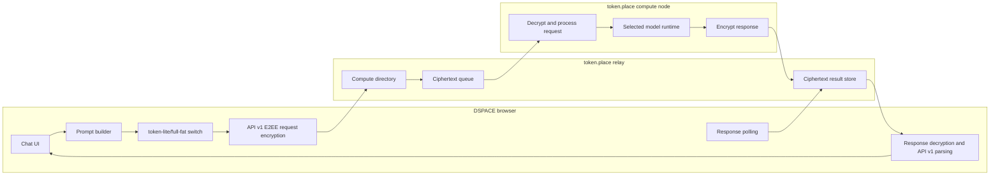
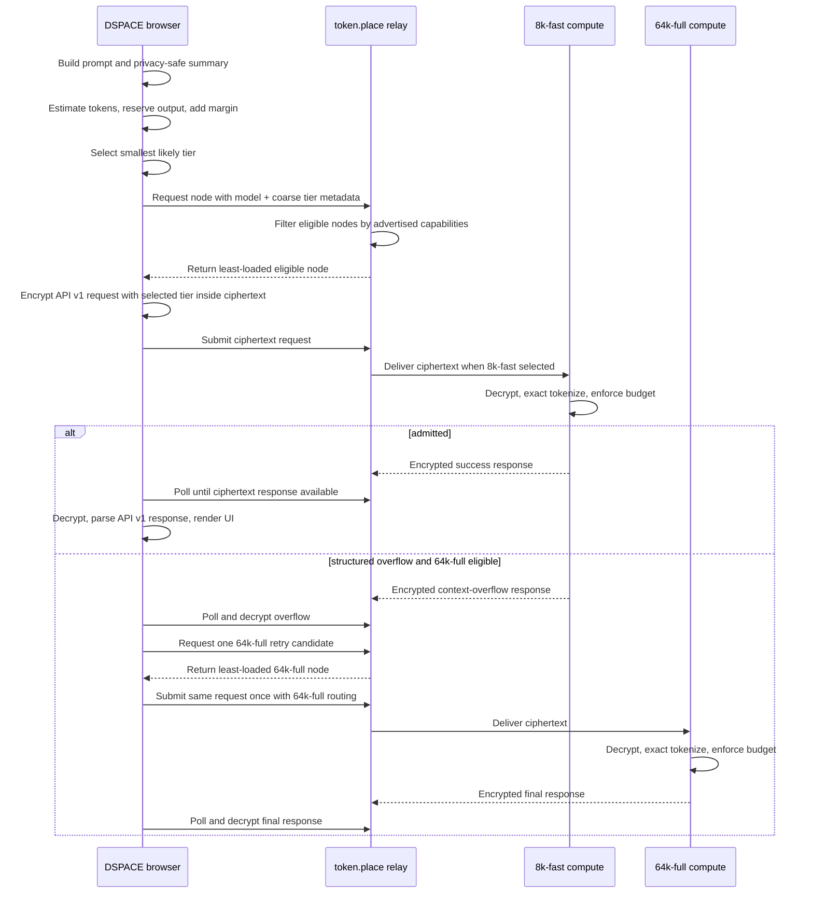

# token.place context tiers for DSPACE full-fat chat

## Status and scope

This design captures the DSPACE-side plan for benchmarking, estimating, routing,
and validating full-fat DSPACE chat through token.place API v1 context tiers.
It is documentation-only and intentionally does not change application code,
API behavior, tests, generated files, package dependencies, or API v2 design.

DSPACE staging build `main-0dd9127` successfully completed token.place API v1
end-to-end encrypted chat with `token-lite` enabled. That staging result proves
that the current request construction, relay selection, encryption, token.place
compute processing, response retrieval, decryption, API v1 parsing, and UI
rendering path works for the lite prompt shape. The remaining blocker for
full-fat DSPACE chat is context capacity and workload routing for prompts that
include system instructions, RAG context, player state, and chat history.

DSPACE's current API v1 request guardrails permit up to 64 messages, 32,768
characters per message, and 131,072 total message-content characters. The
131,072-character ceiling is roughly 32K tokens under the common
four-characters-per-token heuristic, but that is not an exact tokenizer result
and does not include chat-template overhead or output-token reservation.

## Non-goals

- Do not design or modify token.place API v2.
- Do not add API v1 streaming.
- Do not expose prompt text, exact tokenized content, RAG excerpts, player
  state, ciphertext, keys, or decrypted responses to relays or logs.
- Do not silently truncate full-fat prompts after compute-side rejection unless
  a separate user-visible truncation design is approved.
- Do not infer admission from hardware identity, Google AI responses, or
  rule-of-thumb memory estimates alone.
- Do not require token.place relays to understand DSPACE gameplay semantics.
- Do not require DSPACE to know raw operator hardware details.

## Current-state architecture



The relay-visible path is already ciphertext-only for request and response
payloads. P4 through P13 preserve that property while adding coarse,
privacy-safe routing metadata and DSPACE-side estimation so full-fat requests
can reach a node with enough context.

## Initial tier model

| Tier ID    | Total context tokens | Intended initial operator profile                   | Expected DSPACE fit                      |
| ---------- | -------------------: | --------------------------------------------------- | ---------------------------------------- |
| `8k-fast`  |                8,192 | Mac Mini M4 Pro with 24 GB unified memory           | `token-lite` and small full-fat requests |
| `64k-full` |               65,536 | Windows PC with RTX 4090 24 GB VRAM and 128 GB DDR5 | full-fat DSPACE prompts                  |

DSPACE should prefer the smallest tier likely to satisfy the request. The
compute node remains the authoritative admission controller after decrypting
and exactly tokenizing the rendered prompt. Relay-visible routing information
must stay coarse and privacy-safe: relay metadata may include a tier ID, model
capability, safe request ID, and aggregate sizes, but never prompt text or exact
tokenized content.

## DSPACE-side contract

DSPACE owns the browser-side request summary and tier-selection behavior:

1. Build a deterministic prompt-summary structure that never contains user
   content.
2. Estimate prompt size with a browser-safe conservative tokenizer heuristic.
3. Reserve output tokens before classification.
4. Add a safety margin for chat-template overhead, tokenizer mismatch, and
   component growth between measurement and encryption.
5. Produce a tier classification result containing:
   - selected tier;
   - estimated prompt tokens;
   - reserved output tokens;
   - safety margin;
   - estimated total context use;
   - over-limit state.
6. Select a token.place server using the required model and selected context
   tier.
7. Repeat the selected tier inside the encrypted API v1 request so the compute
   node can compare relay routing metadata with decrypted intent.
8. Use context-aware polling deadlines; larger requests may need longer prefill
   and queue budgets than `token-lite`.
9. Retry at most once, and only when the decrypted compute response is a
   structured context-overflow error that indicates a larger advertised tier may
   accept the same request.
10. Never automatically retry policy failures, network errors, malformed
    responses, provider failures, or generic compute failures.
11. Never silently truncate after compute-side rejection unless a future design
    explicitly surfaces truncation to the user.

The selected tier inside the encrypted API v1 body is for compute validation,
not relay inspection. The relay only needs coarse tier metadata to choose an
eligible node.

## Deterministic prompt summary

The summary is safe to log because it contains only counts, timings, and stable
component labels. It must be deterministic for the same rendered prompt shape,
but it must not include message text, RAG excerpts, player names, quest text,
player state JSON values, ciphertext, keys, or decrypted responses.

```json
{
  "schemaVersion": 1,
  "requestId": "safe-random-or-hash-id",
  "mode": "token-lite | full-fat",
  "messageCount": 0,
  "characters": {
    "total": 0,
    "maxPerMessage": 0
  },
  "utf8Bytes": {
    "total": 0,
    "maxPerMessage": 0
  },
  "components": [
    {
      "id": "system-instructions",
      "messageCount": 1,
      "characters": 0,
      "utf8Bytes": 0,
      "estimatedTokens": 0
    },
    {
      "id": "rag-context",
      "messageCount": 0,
      "characters": 0,
      "utf8Bytes": 0,
      "estimatedTokens": 0
    },
    {
      "id": "player-state",
      "messageCount": 0,
      "characters": 0,
      "utf8Bytes": 0,
      "estimatedTokens": 0
    },
    {
      "id": "chat-history",
      "messageCount": 0,
      "characters": 0,
      "utf8Bytes": 0,
      "estimatedTokens": 0
    }
  ],
  "estimate": {
    "estimatedPromptTokens": 0,
    "reservedOutputTokens": 0,
    "safetyMarginTokens": 0,
    "estimatedTotalContextTokens": 0,
    "selectedTier": "8k-fast",
    "overLimit": false,
    "reason": "smallest-capable-tier"
  },
  "timingsMs": {
    "promptBuild": 0,
    "rag": 0,
    "encryption": 0,
    "queueAndRetrieval": 0,
    "endToEnd": 0
  }
}
```

## Benchmark schema

Local benchmark outputs may be JSON and Markdown files, but they must not be
committed with user content. Fixtures must be synthetic or deterministic
repository fixtures. A run should include enough metadata to compare scenarios
without exposing text:

```json
{
  "schemaVersion": 1,
  "createdAt": "2026-06-22T00:00:00.000Z",
  "gitRef": "main-0dd9127-or-local-ref",
  "environment": {
    "app": "dspace",
    "mode": "local | staging",
    "browser": "chromium",
    "tokenPlaceApi": "v1"
  },
  "scenarios": [
    {
      "id": "token-lite-baseline",
      "description": "Synthetic token-lite prompt with no user content",
      "summary": "prompt-summary-object",
      "result": {
        "tierRequested": "8k-fast",
        "tierAdmitted": "8k-fast",
        "safeErrorCode": null,
        "success": true
      }
    }
  ]
}
```

Markdown reports should summarize aggregate counts, p50/p95 timings, selected
tiers, overflow rates, and safe error codes. They should link to local JSON
artifacts only when those artifacts are deliberately retained outside committed
source control.

## Representative benchmark scenarios

| Scenario                            | Purpose                                                       | Expected initial tier    |
| ----------------------------------- | ------------------------------------------------------------- | ------------------------ |
| `token-lite-baseline`               | Preserve the proven staging path from `main-0dd9127`.         | `8k-fast`                |
| `minimal-new-game-state`            | Measure a full-fat prompt with tiny state and little history. | `8k-fast` or `64k-full`  |
| `typical-mid-game-state`            | Capture normal system, RAG, state, and history composition.   | likely `64k-full`        |
| `rag-heavy-state`                   | Stress retrieved context contribution.                        | likely `64k-full`        |
| `long-chat-history`                 | Stress conversation history and template overhead.            | likely `64k-full`        |
| `large-player-state-payload`        | Stress serialized game state contribution.                    | likely `64k-full`        |
| `near-dspace-api-character-ceiling` | Validate estimator behavior near 131,072 characters.          | over-limit or `64k-full` |

## Tier-selection decision table

| Estimated total context use | Available eligible tiers | Selection                   | Notes                                                       |
| --------------------------: | ------------------------ | --------------------------- | ----------------------------------------------------------- |
|                    <= 8,192 | `8k-fast`, `64k-full`    | `8k-fast`                   | Prefer smallest capable tier.                               |
|                    <= 8,192 | `64k-full` only          | `64k-full`                  | Spill small work only when no smaller eligible node exists. |
|             8,193 to 65,536 | `8k-fast`, `64k-full`    | `64k-full`                  | Avoid guaranteed 8K overflow.                               |
|             8,193 to 65,536 | `8k-fast` only           | over-limit/no eligible node | Do not send known oversized work to 8K.                     |
|                    > 65,536 | any                      | over-limit                  | Surface capacity limit; do not silently truncate.           |
|            Unknown estimate | any                      | safest conservative outcome | Prefer explicit over-limit or `64k-full` only if bounded.   |

## Proposed request sequence



## Phase 0: Measurement and instrumentation

Phase 0 measures real DSPACE prompt composition without recording prompt text.
Instrumentation should capture:

- message count;
- total and per-message character count;
- total and per-message UTF-8 byte count;
- estimated tokens;
- component-level contribution for system instructions, RAG context, player
  state, and chat history;
- prompt-build time;
- RAG time;
- encryption time;
- queue/retrieval time;
- end-to-end latency.

Outputs are local JSON and Markdown benchmark artifacts. They are review aids,
not user-content archives, and should be excluded from commits when they could
contain user-derived data. Synthetic and deterministic repository fixtures are
acceptable for committed examples.

## Phase 1: Two static physical tiers

Phase 1 introduces two manually selected physical operator profiles:

- Mac Mini M4 Pro with 24 GB unified memory targets `8k-fast`.
- Windows PC with RTX 4090 24 GB VRAM and 128 GB DDR5 targets `64k-full`.

The token.place operator selects the context tier before startup. A compute node
warms exactly one selected tier before registration. Switching tiers requires
stopping the operator, changing the tier, warming the new runtime, and
re-registering.

DSPACE estimates a tier before selecting a node. Compute nodes enforce the exact
context budget after decryption and exact tokenization. If a structured encrypted
overflow error reports that the request exceeded `8k-fast`, DSPACE may perform
one bounded retry to `64k-full`. No other automatic retries are allowed.

## Phase 2: Capability-aware and load-aware routing

Phase 2 moves routing from blind or round-robin selection to derived service
capabilities:

- Nodes advertise model and context-tier capabilities, not raw hardware
  identity.
- Relay selection filters by model and required context tier.
- The scheduler prefers the smallest capable tier, then the least-loaded node.
- Queue depth, in-flight work, and max concurrency influence selection.
- Small work may spill to a larger tier only when no smaller eligible node is
  available.

This phase belongs primarily to token.place, while DSPACE remains responsible
for producing the safe tier requirement and honoring the returned node choice.

## Phase 3: Runtime optimization

Phase 3 benchmarks runtime settings and backends after correctness and privacy
are stable. Measure:

- flash attention;
- f16, q8, and q4 KV cache modes;
- `offload_kqv`;
- `n_batch` and `n_ubatch`;
- prompt caching;
- backend-specific behavior.

Track memory use, prefill throughput, decode throughput, time to first token or
first response, total latency, and output quality. Do not treat Google AI or
rule-of-thumb memory estimates as sufficient for admission control.

Planning estimate: a 64K f16 KV cache for Llama 3.1 8B GQA may consume roughly
8 GB before model weights and runtime buffers. That estimate is only a planning
input and requires empirical verification on the target runtime and hardware.

## Phase 4: Same-device multi-tier research

Phase 4 is future research, not initial implementation. Investigations include:

- multiple high-level `Llama` instances;
- one shared model with multiple low-level llama.cpp contexts;
- a `llama-server` sidecar with slots, continuous batching, prompt caching,
  metrics, and speculative decoding;
- dynamic tier switching or eviction based on available memory.

These options should be evaluated after the two-static-tier contract is stable
and benchmark data shows where operator memory is actually constrained.

## Privacy and observability requirements

- Never log message text, RAG excerpts, player state, keys, ciphertext, or
  decrypted responses.
- Telemetry may contain counts, durations, tier IDs, safe error codes, request
  IDs, and aggregate sizes.
- Production instrumentation must be opt-in or emitted only through existing
  privacy-safe diagnostics.
- Benchmark fixtures must be synthetic or deterministic repository fixtures.
- Relay-visible requests must remain ciphertext-only for prompt and response
  bodies.
- Exact tokenized content is compute-local after decryption and must not be
  returned to the relay.

## Failure modes

| Failure mode                        | Detection point                | DSPACE action                                                            | Retry?                  |
| ----------------------------------- | ------------------------------ | ------------------------------------------------------------------------ | ----------------------- |
| Browser estimate exceeds `64k-full` | DSPACE before encryption       | Show capacity error; do not submit.                                      | No                      |
| No eligible tier node               | Relay selection                | Show unavailable-capacity message.                                       | No                      |
| 8K context overflow                 | Compute after decrypt/tokenize | Decrypt structured overflow and escalate once to `64k-full` if eligible. | Once                    |
| 64K context overflow                | Compute after decrypt/tokenize | Show capacity error; no silent truncation.                               | No                      |
| Policy failure                      | Compute/provider response      | Surface policy-safe failure.                                             | No                      |
| Network or relay failure            | Submission or polling          | Surface connectivity failure using existing API v1 handling.             | No automatic tier retry |
| Malformed response                  | DSPACE API v1 parse            | Surface malformed-response error.                                        | No                      |
| General provider failure            | Compute/provider response      | Surface provider failure with safe code.                                 | No                      |
| Timeout on large context            | Context-aware polling deadline | Surface timeout; keep request ID for diagnostics.                        | No automatic tier retry |

## Acceptance and testing strategy

- Unit tests for estimator boundaries and tier selection.
- Unit tests for UTF-8, code-heavy, JSON-heavy, whitespace-heavy, and long-RAG
  inputs.
- End-to-end tests with mocked `8k-fast` and `64k-full` compute-node responses.
- Staging validation for `token-lite` on `8k-fast` and full-fat chat on
  `64k-full`.
- Verification that relay-visible requests remain ciphertext-only, with only
  safe routing metadata exposed.
- Verification that retry is bounded to one tier escalation.
- Verification that DSPACE repeats the selected tier inside the encrypted API v1
  request and compute rejects mismatched or over-budget requests safely.

## Rollout plan

1. Land this design document.
2. Add Phase 0 privacy-safe prompt measurement behind local or opt-in
   diagnostics.
3. Produce synthetic benchmark fixtures and local benchmark reporting.
4. Add DSPACE estimator and tier classification without changing the proven
   `token-lite` default path.
5. Register two token.place tier profiles and validate manual operator startup.
6. Route `token-lite` to `8k-fast` in staging.
7. Route full-fat chat to `64k-full` in staging.
8. Enable one bounded 8K-to-64K retry only after structured overflow responses
   are available and tested.
9. Expand load-aware scheduling once capability registration is stable.

## Rollback plan

- Disable full-fat tier selection and keep `token-lite` on the proven API v1
  path.
- Remove or ignore relay tier metadata while preserving ciphertext-only request
  handling.
- Disable bounded overflow retry and surface compute overflow directly.
- Stop `64k-full` operators without affecting `8k-fast` token-lite capacity.
- Keep benchmark instrumentation disabled unless explicitly opted in.

## Open questions

- What conservative browser estimator gives the best false-positive/false-
  negative tradeoff before exact browser tokenization exists?
- How much output-token reservation should DSPACE use for normal chat, long
  explanations, and tool-like responses?
- Should DSPACE expose a user-facing explanation when full-fat chat requires a
  slower `64k-full` tier?
- Which safe error-code vocabulary should token.place standardize for context
  overflow, no capacity, timeout, malformed request, and provider failure?
- How should benchmark artifacts be named and ignored so local measurement is
  easy but user content is not committed?
- What polling deadlines are appropriate for 8K and 64K requests under realistic
  queue depth?
- Should the encrypted selected-tier field be advisory, required, or rejected
  when it disagrees with relay-selected metadata?

## Future work

- Exact browser tokenizer for DSPACE preflight estimates.
- `llama-server` sidecar evaluation.
- Multiple warm contexts on one operator.
- Shared-model contexts with isolated low-level llama.cpp contexts.
- Dynamic memory selection and eviction.
- Advanced scheduling across tier, queue depth, latency, and reliability.
- Prompt caching for stable system instructions and repeated RAG prefixes.
- Speculative decoding where supported by the backend.
- API v2 streaming design, explicitly outside this API v1 document.
