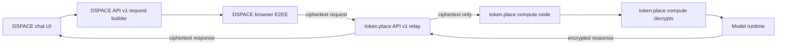
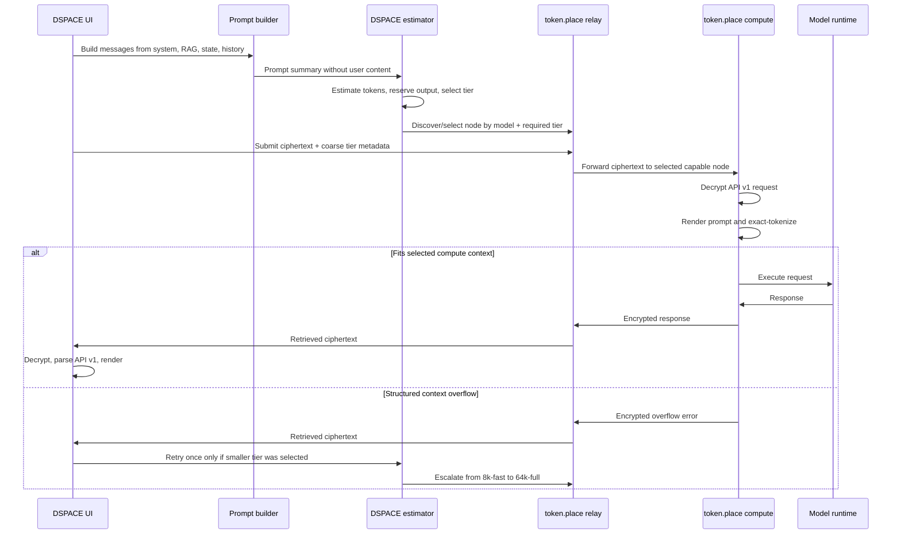

# DSPACE token.place context tiers

## Purpose

DSPACE staging build `main-0dd9127` has already completed a token.place API v1
end-to-end encrypted chat with token-lite enabled. That staging pass proves the
current API v1 path works across DSPACE request construction, relay selection,
encryption, token.place compute processing, response retrieval, decryption, API
v1 parsing, and UI rendering.

The remaining blocker for full-fat DSPACE chat is not the basic encrypted API
path. The blocker is context capacity and workload routing for prompts that may
include system instructions, retrieval-augmented-generation context, player
state, and chat history. This document defines the DSPACE-side design for
benchmarking, estimating, routing, and validating those full-fat requests through
token.place context tiers while keeping token.place responsibilities explicit.

## Scope

DSPACE owns:

- Measuring DSPACE prompt composition without recording user content.
- Estimating context demand in the browser before selecting a token.place node.
- Classifying each request into the smallest likely-sufficient context tier.
- Sending privacy-safe, coarse routing metadata to token.place relays.
- Repeating the selected tier inside the encrypted API v1 request so compute can
  validate caller intent after decryption.
- Applying context-aware polling deadlines and one bounded tier-escalation retry
  for a structured compute-side context overflow.
- Surfacing compute-side context rejection without silent truncation unless a
  separate, user-visible truncation design is approved.

Token.place owns:

- API v1 relay registration, discovery, encrypted request transport, and
  ciphertext-only response retrieval.
- Compute-node capability registration for model and context tier support.
- Relay scheduling that uses only coarse, privacy-safe routing metadata.
- Compute-side exact prompt rendering, tokenization, admission control, model
  execution, and structured encrypted overflow responses.
- Operator/runtime lifecycle for warming, registering, and deregistering nodes.

Non-owned token.place work is cross-referenced here only to define the interface
DSPACE expects. This document does not design or modify API v2.

## Current state

DSPACE currently permits up to:

- 64 API v1 messages.
- 32,768 characters per message.
- 131,072 total message-content characters.

The 131,072-character ceiling is roughly 32K tokens under the common
four-characters-per-token heuristic. That is only a planning approximation: it is
not an exact tokenizer result, does not include chat-template overhead, and does
not reserve output tokens. Compute remains the authoritative admission controller
after decrypting the request and exactly tokenizing the rendered prompt.

Initial token.place context profiles are:

| Tier       | Total context tokens | Intended initial role                     |
| ---------- | -------------------: | ----------------------------------------- |
| `8k-fast`  |                8,192 | Fast token-lite and small DSPACE requests |
| `64k-full` |               65,536 | Full-fat DSPACE prompts and large state   |

DSPACE should prefer the smallest tier likely to satisfy the request. Token-lite
should normally fit `8k-fast`; full-fat DSPACE prompts may require `64k-full`.

## Current-state architecture



In the proven token-lite path, relay-visible data stays ciphertext-only except
for API v1 metadata needed to route and retrieve the request. The full-fat design
preserves that property while adding coarse context-tier metadata.

## Proposed request sequence



## DSPACE-side contract

### Prompt summary

DSPACE produces a deterministic prompt-summary structure before encryption. It
must never contain user content, RAG excerpts, player-state values, message text,
keys, ciphertext, or decrypted responses. It may contain component names, counts,
UTF-8 byte lengths, character lengths, estimated token counts, and durations.

Example shape:

```json
{
  "schemaVersion": 1,
  "requestMode": "full-fat",
  "messageCount": 18,
  "components": [
    {
      "name": "system",
      "messageCount": 1,
      "characterCount": 4200,
      "utf8ByteCount": 4200,
      "estimatedTokens": 1050
    },
    {
      "name": "rag",
      "messageCount": 4,
      "characterCount": 18000,
      "utf8ByteCount": 18420,
      "estimatedTokens": 4605
    }
  ],
  "totals": {
    "characterCount": 44000,
    "utf8ByteCount": 45240,
    "estimatedPromptTokens": 11310
  }
}
```

### Conservative browser estimate

The browser estimator is intentionally conservative because it cannot be the
source of truth for exact context admission. It should account for:

- Total message-content characters and UTF-8 bytes.
- A conservative character-to-token estimate.
- Message count and chat-template overhead.
- Code-heavy, JSON-heavy, whitespace-heavy, Unicode, and long-RAG inputs.
- Reserved output tokens.
- A safety margin for tokenizer mismatch, template changes, and future metadata.

The estimator output is deterministic for the same prompt summary and settings.
It is suitable for tier selection and user-facing diagnostics, not final
admission.

### Tier classification result

Every DSPACE request receives a tier classification result:

```json
{
  "selectedTier": "64k-full",
  "estimatedPromptTokens": 11310,
  "reservedOutputTokens": 2048,
  "safetyMarginTokens": 2048,
  "estimatedTotalContextUse": 15406,
  "overLimit": false
}
```

The fields are:

| Field                      | Meaning                                               |
| -------------------------- | ----------------------------------------------------- |
| `selectedTier`             | Smallest tier likely to satisfy the request.          |
| `estimatedPromptTokens`    | Browser-safe prompt estimate before output reserve.   |
| `reservedOutputTokens`     | Tokens held for the model response.                   |
| `safetyMarginTokens`       | Conservative buffer above prompt and output estimate. |
| `estimatedTotalContextUse` | Prompt estimate plus output reserve and margin.       |
| `overLimit`                | True when no known tier is likely to fit.             |

### Decision table

|              Estimated total context use | DSPACE selection                 | Expected behavior                                 |
| ---------------------------------------: | -------------------------------- | ------------------------------------------------- |
|                               `<= 8,192` | `8k-fast`                        | Prefer smallest capable token.place node.         |
|                      `8,193` to `65,536` | `64k-full`                       | Route directly to the full tier.                  |
|                               `> 65,536` | No eligible tier                 | Do not submit silently; surface over-limit state. |
|                         Unknown estimate | `64k-full` only if policy allows | Prefer safe failure over blind 8K submission.     |
|  Compute rejects `8k-fast` with overflow | Retry once on `64k-full`         | Only for structured encrypted overflow.           |
| Compute rejects `64k-full` with overflow | Stop                             | Surface context-capacity failure to the user.     |

### Routing and retries

DSPACE sends only coarse routing metadata to the relay, such as requested model,
required tier, safe request ID, and safe diagnostic flags. Prompt text, exact
rendered prompt tokens, player state, RAG excerpts, keys, ciphertext internals,
and decrypted responses are never relay-visible.

The selected tier is also repeated inside the encrypted API v1 request. Compute
uses that encrypted value to verify the caller-selected tier after decryption and
before exact admission.

Polling deadlines become context-aware. Larger tiers may need longer queue,
prefill, and decode windows than token-lite requests. Deadline configuration
should be explicit, bounded, and observable through privacy-safe duration
metrics.

DSPACE may retry automatically exactly once when all conditions are true:

1. The original request selected `8k-fast`.
2. The decrypted compute response is a structured context-overflow error.
3. A `64k-full` node is available for the same model and API v1 capability.
4. The retry reuses the same prompt inputs and produces a new encrypted request.

DSPACE must not automatically retry for policy failures, network failures,
malformed responses, relay failures, provider failures, or general compute
errors. DSPACE must not silently truncate after compute-side rejection unless a
separate truncation strategy is designed, tested, and surfaced to the user.

## Benchmark schema

Phase 0 benchmark outputs are local artifacts only. They must not include user
content and should not be committed when generated from real sessions. Synthetic
or deterministic repository fixtures may be committed if explicitly intended as
test fixtures.

Suggested JSON schema:

```json
{
  "schemaVersion": 1,
  "generatedAt": "2026-06-22T00:00:00.000Z",
  "dspaceBuild": "main-0dd9127",
  "scenario": "rag-heavy-state",
  "requestMode": "full-fat",
  "messageCount": 18,
  "limits": {
    "maxMessages": 64,
    "maxCharactersPerMessage": 32768,
    "maxTotalMessageContentCharacters": 131072
  },
  "components": [
    {
      "name": "rag",
      "messageCount": 4,
      "characterCount": 18000,
      "utf8ByteCount": 18420,
      "estimatedTokens": 4605
    }
  ],
  "totals": {
    "characterCount": 44000,
    "utf8ByteCount": 45240,
    "estimatedPromptTokens": 11310,
    "reservedOutputTokens": 2048,
    "safetyMarginTokens": 2048,
    "estimatedTotalContextUse": 15406
  },
  "tierClassification": {
    "selectedTier": "64k-full",
    "overLimit": false
  },
  "durationsMs": {
    "promptBuild": 32,
    "rag": 128,
    "encryption": 18,
    "queueAndRetrieval": 4100,
    "endToEnd": 7800
  }
}
```

Markdown summaries should aggregate safe counts, durations, and tier outcomes by
scenario. They should omit raw prompt text and any generated model responses.

## Roadmap

### Phase 0: Measurement and instrumentation

Measure real DSPACE prompt composition without recording prompt text. Capture:

- Message count.
- Character count.
- UTF-8 byte count.
- Estimated tokens.
- Component-level contribution.
- Prompt-build time.
- RAG time.
- Encryption time.
- Queue/retrieval time.
- End-to-end latency.

Representative benchmark scenarios:

| Scenario                          | Purpose                                                 |
| --------------------------------- | ------------------------------------------------------- |
| Token-lite baseline               | Verify the known working small-prompt path.             |
| Minimal new-game state            | Establish the smallest full-fat request shape.          |
| Typical mid-game state            | Measure normal system, state, RAG, and history mix.     |
| RAG-heavy state                   | Stress retrieval contribution and prompt assembly time. |
| Long chat history                 | Stress message-count and template overhead.             |
| Large player-state payload        | Stress state serialization and UTF-8 byte counts.       |
| Near-DSPACE API character ceiling | Validate estimator behavior near 131,072 characters.    |

Outputs:

- Local JSON benchmark records using the schema above.
- Local Markdown summaries for human review.
- No committed real user content.
- Synthetic fixtures only when deterministic and intentionally reviewed.

### Phase 1: Two static physical tiers

Initial physical tier mapping:

| Hardware                                     | Target tier | Notes                             |
| -------------------------------------------- | ----------- | --------------------------------- |
| Mac Mini M4 Pro, 24 GB unified memory        | `8k-fast`   | Token-lite and small requests.    |
| Windows PC, RTX 4090 24 GB VRAM, 128 GB DDR5 | `64k-full`  | Full-fat context-capacity target. |

Context tier is selected manually before starting the token.place operator. A
compute node warms exactly one selected tier before registration. Switching
requires stopping the operator, changing the selected tier, warming the new
runtime, and re-registering.

DSPACE estimates the required tier before selecting a node. Compute nodes enforce
the exact context budget after decryption. A structured encrypted overflow error
may trigger one DSPACE retry from `8k-fast` to `64k-full`.

### Phase 2: Capability-aware and load-aware routing

Nodes advertise derived service capabilities rather than raw hardware identity.
The relay filters by model and required context tier. The scheduler prefers the
smallest capable tier, then the least-loaded node.

Selection inputs include:

- Queue depth.
- In-flight work.
- Max concurrency.
- Model capability.
- Context tier capability.
- API v1 encrypted chat capability.

Small work may spill to a larger tier only when no smaller eligible node is
available. Spillover should be observable through safe tier-selection metrics so
operators can detect when `8k-fast` capacity is insufficient.

### Phase 3: Runtime optimization

Benchmark runtime settings empirically instead of relying on generic memory
estimates. The matrix should include:

- Flash attention.
- f16, q8, and q4 KV cache.
- `offload_kqv`.
- `n_batch`.
- `n_ubatch`.
- Prompt caching.
- Backend-specific behavior.

Track:

- Memory usage.
- Prefill throughput.
- Decode throughput.
- Time to first token or first response.
- Total latency.
- Output quality.

Do not assume Google AI or rule-of-thumb memory estimates are sufficient for
admission. Record the planning estimate that a 64K f16 KV cache for Llama 3.1 8B
GQA may consume roughly 8 GB before model weights and runtime buffers, but
require empirical verification before using that estimate for operator
admission, scheduling, or guarantees.

### Phase 4: Same-device multi-tier research

Future investigations, not initial implementation:

- Multiple high-level `Llama` instances.
- One shared model with multiple low-level llama.cpp contexts.
- A llama-server sidecar with slots, continuous batching, prompt caching,
  metrics, and speculative decoding.
- Dynamic tier switching or eviction based on available memory.

These options may reduce operator friction or improve utilization, but they
increase complexity around memory accounting, warm-context lifecycle, scheduling,
and failure isolation. They should follow empirical Phase 3 results.

## Privacy and observability

Never log:

- Message text.
- RAG excerpts.
- Player-state values.
- Keys.
- Ciphertext.
- Decrypted responses.

Telemetry may contain:

- Counts.
- Durations.
- Tier IDs.
- Safe error codes.
- Request IDs.
- Aggregate sizes.

Production instrumentation must be opt-in or emitted only through existing
privacy-safe diagnostics. Benchmark fixtures must be synthetic or deterministic
repository fixtures. Real-session benchmark output must remain local and must be
reviewed before sharing.

## Failure modes

| Failure mode                               | Detection                         | DSPACE behavior                                   |
| ------------------------------------------ | --------------------------------- | ------------------------------------------------- |
| Estimated request exceeds `64k-full`       | Browser estimator                 | Do not submit silently; show over-limit state.    |
| No node for selected tier                  | Relay discovery/selection         | Surface unavailable capacity; no blind retry.     |
| Compute exact-token overflow on `8k-fast`  | Structured encrypted error        | Retry once on `64k-full` if available.            |
| Compute exact-token overflow on `64k-full` | Structured encrypted error        | Stop and surface context-capacity failure.        |
| Network or relay failure                   | API v1 transport error            | Use existing failure path; no tier escalation.    |
| Policy failure                             | Structured provider/compute error | Surface policy failure; no automatic retry.       |
| Malformed response                         | API v1 parser/decrypt path        | Fail closed; no automatic retry.                  |
| Provider/runtime failure                   | Safe compute error code           | Surface failure; no automatic retry.              |
| Relay sees prompt text                     | Privacy test failure              | Block release; relay metadata must stay coarse.   |
| Estimator underestimates                   | Compute overflow                  | Use bounded escalation only if eligible.          |
| Estimator overestimates                    | Tier metrics                      | Tune estimator after benchmarks; preserve safety. |

## Acceptance and testing strategy

Unit coverage:

- Estimator boundaries around 8,192 and 65,536 total context tokens.
- Tier selection for token-lite, small full-fat, large full-fat, and over-limit
  cases.
- UTF-8, code-heavy, JSON-heavy, whitespace-heavy, and long-RAG inputs.
- Output-token reservation and safety-margin arithmetic.
- Deterministic prompt-summary output that contains no user content fields.

End-to-end coverage:

- Mocked `8k-fast` compute-node success.
- Mocked `64k-full` compute-node success.
- Mocked `8k-fast` structured overflow followed by exactly one `64k-full` retry.
- Mocked `64k-full` overflow with no additional retry.
- Mocked policy, network, malformed-response, and provider failures with no tier
  retry.
- Relay-visible request inspection proving ciphertext-only payloads plus coarse
  routing metadata.

Staging validation:

- Token-lite on `8k-fast`.
- Full-fat chat on `64k-full`.
- Context-aware polling deadlines under realistic queue and prefill durations.
- Safe telemetry containing counts, durations, tier IDs, safe errors, request
  IDs, and aggregate sizes only.

## Rollout plan

1. Land this design document.
2. Add Phase 0 instrumentation behind opt-in diagnostics or local benchmark
   commands.
3. Generate local benchmark data from synthetic and real-but-uncommitted runs.
4. Implement Phase 1 static tier profiles and DSPACE estimator tests.
5. Validate token-lite on `8k-fast` in staging.
6. Validate full-fat DSPACE chat on `64k-full` in staging.
7. Enable bounded overflow retry after structured compute errors are available.
8. Introduce Phase 2 capability-aware and load-aware relay selection.
9. Use Phase 3 benchmarks to tune runtime profiles.

## Rollback plan

- Disable full-fat tier selection and keep token-lite on the known working API v1
  path.
- Disable automatic overflow retry independently from tier estimation.
- Fall back to manual operator selection if load-aware scheduling misroutes work.
- Keep compute-side exact admission enabled; do not bypass it during rollback.
- Preserve privacy-safe instrumentation so rollback analysis does not require
  prompt text.

## Non-goals

- Designing or modifying API v2.
- Adding API v1 streaming.
- Sending prompt text, exact rendered tokens, RAG excerpts, player-state values,
  keys, ciphertext internals, or decrypted responses to relays.
- Making the browser estimator authoritative for admission.
- Silent truncation after compute-side context rejection.
- Automatic retries for policy, network, malformed-response, relay, provider, or
  general compute failures.
- Runtime dependency changes in DSPACE solely for this design phase.
- Committing benchmark output generated from real user content.

## Open questions

- What initial reserved-output-token value best balances answer quality and
  admission success for DSPACE full-fat chat?
- How large should the safety margin be for token-lite versus full-fat prompts?
- Which prompt components should be separately reported in benchmark summaries?
- What exact structured overflow error code should token.place compute return
  inside the encrypted API v1 response?
- How should the UI explain over-limit failures without exposing internal prompt
  construction details?
- What polling deadline profile should apply to each tier before streaming or
  other API v2 work exists?
- Should DSPACE expose a developer-only prompt budget preview during staging?

## Future work

Long-term issue themes intentionally left outside the initial implementation:

- Exact browser tokenizer for the deployed model and chat template.
- llama-server sidecar with slots and metrics.
- Multiple warm contexts on one device.
- Shared-model contexts using low-level llama.cpp APIs.
- Dynamic memory-based tier selection and eviction.
- Advanced scheduling beyond least-loaded capable node selection.
- Prompt caching informed by DSPACE system and RAG component stability.
- Speculative decoding for latency reduction.
- API v2 streaming after the API v1 non-streaming path is stable.
